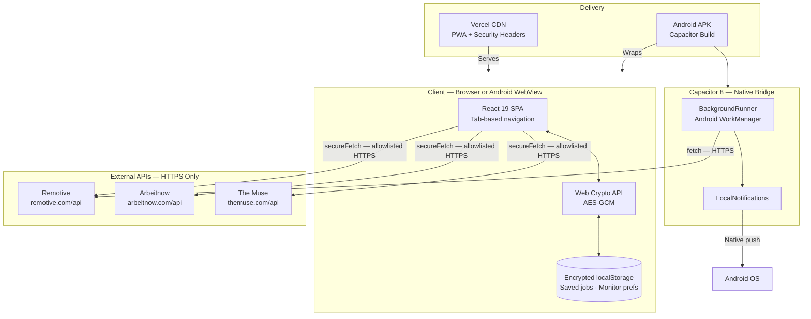
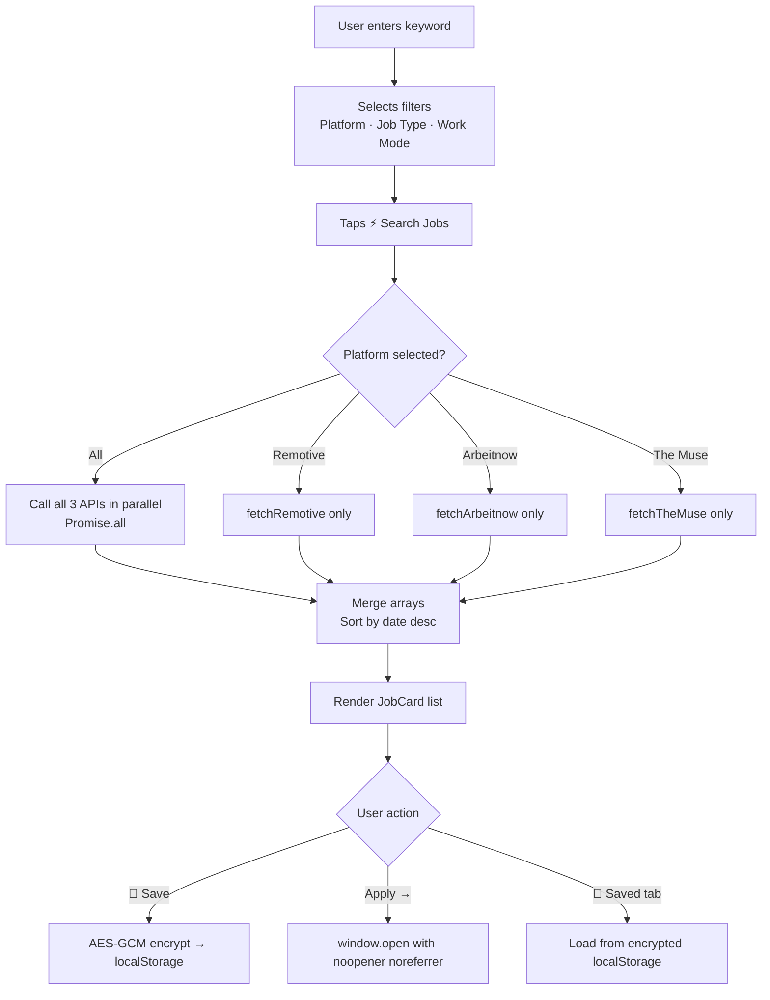
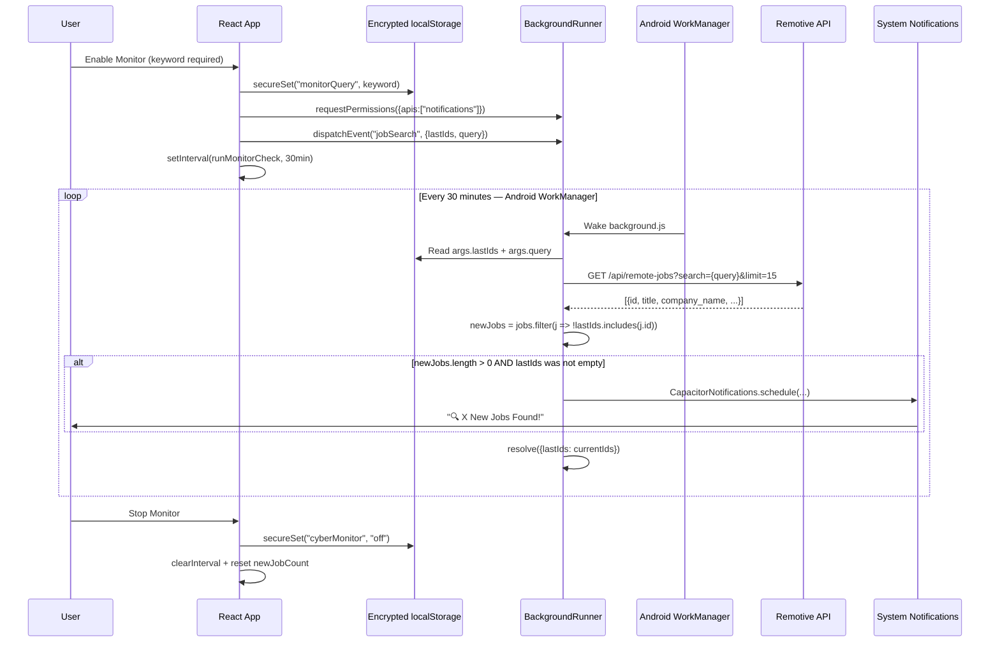

<div align="center">

<br />

```
     ██╗ ██████╗ ██████╗ ██╗  ██╗██╗   ██╗███╗   ██╗████████╗
     ██║██╔═══██╗██╔══██╗██║  ██║██║   ██║████╗  ██║╚══██╔══╝
     ██║██║   ██║██████╔╝███████║██║   ██║██╔██╗ ██║   ██║
██   ██║██║   ██║██╔══██╗██╔══██║██║   ██║██║╚██╗██║   ██║
╚█████╔╝╚██████╔╝██████╔╝██║  ██║╚██████╔╝██║ ╚████║   ██║
 ╚════╝  ╚═════╝ ╚═════╝ ╚═╝  ╚═╝ ╚═════╝ ╚═╝  ╚═══╝   ╚═╝
```

### Multi-Platform Job Search — Web PWA + Android APK

<br/>

[](https://react.dev)
[](https://capacitorjs.com)
[](LICENSE)
[](#installation)
[](https://vercel.com)
[](CONTRIBUTING.md)
[](#api-sources)
[](#architecture)

<br/>

**JobHunt** is a zero-backend, privacy-first job search application delivered as both a  
Progressive Web App and a native Android APK — from a single React codebase.

It aggregates live listings from three free public APIs, filters by platform, job type, and  
work mode, persists bookmarks in AES-GCM encrypted local storage, and monitors  
for new postings every 30 minutes — sending push notifications even when the app is closed.

<br/>

[**Live Demo**](https://cyberhunt-taupe.vercel.app) &nbsp;·&nbsp;
[**Download APK**](https://cyberhunt-taupe.vercel.app/cyberhunt.apk) &nbsp;·&nbsp;
[**Report Bug**](https://github.com/yourusername/jobhunt/issues) &nbsp;·&nbsp;
[**Request Feature**](https://github.com/yourusername/jobhunt/issues/new)

</div>

---

## Table of Contents

- [Overview](#overview)
- [Features](#features)
- [Tech Stack](#tech-stack)
- [Architecture](#architecture)
- [Screenshots](#screenshots)
- [Quick Start](#quick-start)
- [Installation](#installation)
- [Project Structure](#project-structure)
- [How It Works](#how-it-works)
- [API Sources](#api-sources)
- [Security](#security)
- [Deployment](#deployment)
- [Code Quality & Known Issues](#code-quality--known-issues)
- [Contributing](#contributing)
- [Roadmap](#roadmap)
- [FAQ](#faq)
- [License](#license)

---

## Overview

Modern job seekers jump between multiple browser tabs, apps, and email inboxes just to stay on top of the market. JobHunt consolidates the search into a single mobile-first interface:

- **Aggregate** three live APIs into one ranked feed
- **Filter** by platform, job type (full-time, internship, contract, part-time), and work mode (remote, hybrid, on-site)
- **Bookmark** listings persistently with client-side encryption
- **Monitor** the market 24/7 from the Android background — no server required
- **Deploy** as a web PWA or install natively as an Android APK, both from the same source

No account creation. No data sent to any proprietary server. No API keys to manage.

---

## Features

### 🔍 Multi-Platform Job Search
Search across **Remotive**, **Arbeitnow**, and **The Muse** simultaneously, or select a single platform to isolate results. All three APIs are free with no authentication requirement.

### 🎛️ Three-Axis Filtering System

| Filter | Options |
|--------|---------|
| **Platform** | All Platforms · Remotive · Arbeitnow · The Muse |
| **Job Type** | All Types · Full-time · Part-time · Internship · Contract |
| **Work Mode** | All · 🏠 Remote · 🔀 Hybrid · 🏢 On-site |

Platform selection controls which APIs are actually called — it is not a client-side filter applied after fetching everything.

### 📌 Encrypted Persistent Bookmarks
- One-tap save on any job card
- Bookmarks survive page reload and app restart (stored in AES-GCM encrypted `localStorage`)
- Remove from the Saved tab or directly from the Search result

### 📡 24/7 Background Job Monitor
- Monitors Remotive for your keyword every **30 minutes** via Android WorkManager
- Sends a native push notification the moment new jobs appear
- Remembers seen job IDs to prevent duplicate alerts
- Continues running when the app is fully closed (Android only)
- Counter resets cleanly when monitoring is stopped and restarted

### 🔔 Email Alert Setup
- One-tap setup links for LinkedIn, Indeed, Google Alerts, and Otta
- Setup progress tracked and persisted across sessions
- In-app browser notification toggle as a supplementary alert channel

### 🔒 Privacy by Design
- Zero backend — no personal data ever leaves the device to a proprietary server
- All persistent state encrypted with AES-GCM (Web Crypto API, 12-byte random IV per write)
- Secure fetch layer enforces HTTPS-only connections to a hardcoded allowlist of three origins
- Android network security config blocks cleartext and user-installed certificates

### 📱 Dual Delivery
- Installable as a PWA from any browser
- Native Android APK download banner shown automatically to Android browser users
- Vercel deployment with a full production security header suite

---

## Tech Stack

### Frontend

| Technology | Role | Version |
|-----------|------|---------|
| React | UI framework | 19 |
| Create React App | Build toolchain | 5.0.1 |
| Web Crypto API | AES-GCM encryption | Browser native |

### Mobile

| Technology | Role | Version |
|-----------|------|---------|
| Capacitor | Native bridge (Android WebView) | 8.4.0 |
| @capacitor/background-runner | Android WorkManager tasks | 3.0.0 |
| @capacitor/local-notifications | Native push notifications | 8.2.0 |

### Android Build

| Technology | Version |
|-----------|---------|
| Android Gradle Plugin | 9.2.1 |
| Min SDK | 24 (Android 7.0) |
| Target SDK | 36 |
| Compile SDK | 36 |

### Infrastructure

| Technology | Role |
|-----------|------|
| Vercel | Web hosting, CDN, security headers |
| GitHub | Source control |

### External APIs (no keys required)

| API | URL |
|-----|-----|
| Remotive | `https://remotive.com/api/remote-jobs` |
| Arbeitnow | `https://www.arbeitnow.com/api/job-board-api` |
| The Muse | `https://www.themuse.com/api/public/jobs` |

---

## Architecture

### System Overview



### Key Design Decisions

| Decision | Rationale |
|----------|-----------|
| No backend server | Eliminates infrastructure cost, maintenance, and user data liability |
| Capacitor over React Native | Single React codebase shared between web and Android with minimal native code |
| WorkManager over foreground service | Battery-efficient, OS-managed, recommended by Android for deferred repeating work |
| AES-GCM for localStorage | Client-side confidentiality for bookmarks without requiring a backend auth system |
| Inline styles over CSS files | Eliminates class name collisions in a single-file component; simpler for a one-developer project |

---


## Quick Start

No environment variables or API keys are required.

```bash
# Clone
git clone https://github.com/yourusername/jobhunt.git
cd jobhunt

# Install
npm install

# Develop
npm start
```

Visit [http://localhost:3000](http://localhost:3000).

---

## Installation

### Prerequisites

| Requirement | Minimum | Purpose |
|-------------|---------|---------|
| Node.js | 18.x | Development server, build |
| npm | 9.x | Package management |
| Android Studio | Latest | APK builds only |
| JDK | 17 | Android builds only |

### Web Development

```bash
npm install       # install dependencies
npm start         # start dev server on :3000
npm run build     # production build → /build
npm test          # run test suite
```

### Android APK Build

```bash
# Step 1 — build the React app
npm run build

# Step 2 — sync the web build into the Android project
npx cap sync android

# Step 3 — open Android Studio
npx cap open android

# Step 4 — in Android Studio:
#   Build → Generate Signed Bundle / APK → APK
#   Output: android/app/release/app-release.apk
```

### Deploy to Vercel

```bash
# Option A — Vercel CLI
npm run build
npx vercel --prod

# Option B — GitHub integration
# Push to main → Vercel auto-deploys via vercel.json config
```

---

## Project Structure

```
jobhunt/
├── public/
│   ├── index.html              # HTML shell — title: "JobHunt — Multi-Platform Job Search"
│   ├── manifest.json           # PWA manifest — name, icons, theme #0D1117
│   ├── background.js           # WorkManager background task (runs every 30 min, no React)
│   ├── cyberhunt.apk           # Pre-built APK served for Android browser download
│   ├── favicon.ico
│   ├── logo192.png
│   ├── logo512.png
│   └── robots.txt
│
├── src/
│   ├── App.js                  # Entire application (780 lines)
│   │   ├── getCryptoKey()      # AES-GCM key derivation
│   │   ├── secureSet/Get()     # Encrypted localStorage read/write
│   │   ├── secureFetch()       # HTTPS-only allowlisted fetch wrapper
│   │   ├── PLATFORMS           # Platform filter options + colors
│   │   ├── JOB_TYPES           # Job type filter options
│   │   ├── WORK_MODES          # Work mode filter options
│   │   ├── ALERT_PLATFORMS     # Email alert platform links
│   │   ├── fetchRemotive()     # Remotive API call
│   │   ├── fetchArbeitnow()    # Arbeitnow API call + client filtering
│   │   ├── fetchTheMuse()      # The Muse API call
│   │   ├── RadarPulse          # Animated header icon component
│   │   ├── Toast               # Transient notification component
│   │   ├── FilterChips         # Reusable filter row component
│   │   ├── JobCard             # Job listing card component
│   │   ├── AlertCard           # Email alert platform card component
│   │   └── JobHunt()           # Root component — all state + tabs
│   ├── index.js                # ReactDOM.createRoot mount
│   ├── index.css               # Body font reset
│   └── App.css                 # Legacy CRA file (unused by app)
│
├── android/
│   ├── app/
│   │   ├── build.gradle        # App module — minSdk 24, targetSdk 36, versionCode 1
│   │   ├── capacitor.build.gradle
│   │   └── src/main/
│   │       ├── AndroidManifest.xml           # INTERNET permission, cleartext blocked
│   │       ├── java/com/bula/cyberhunt/
│   │       │   └── MainActivity.java         # extends BridgeActivity (one line)
│   │       ├── assets/
│   │       │   ├── capacitor.config.json     # Compiled from capacitor.config.ts
│   │       │   ├── capacitor.plugins.json    # BackgroundRunner + LocalNotifications
│   │       │   └── public/                   # Built React app bundled into APK
│   │       └── res/
│   │           ├── xml/network_security_config.xml  # HTTPS-only, system CAs
│   │           ├── xml/config.xml
│   │           ├── values/strings.xml        # App name: "JobHunt"
│   │           ├── values/styles.xml
│   │           └── drawable*/                # Splash screen + launcher icons
│   ├── build.gradle            # Root Gradle — AGP 9.2.1, google-services 4.4.4
│   ├── variables.gradle        # SDK version constants
│   ├── settings.gradle
│   └── capacitor.settings.gradle
│
├── capacitor.config.ts         # Capacitor config source (compiled to assets/capacitor.config.json)
├── vercel.json                 # Deployment config + security headers
├── package.json                # Dependencies + npm scripts
├── .gitignore
│
└── docs/
    ├── ARCHITECTURE.md
    ├── API.md
    ├── DEPLOYMENT.md
    ├── ROADMAP.md
    ├── INSTALL.md
    ├── PROJECT_STRUCTURE.md
    └── TESTING.md
```

---

## How It Works

### Search Flow



### Background Monitor Flow



### Encryption Flow

```mermaid
flowchart LR
    A[Data to persist] --> B[JSON.stringify]
    B --> C[TextEncoder → Uint8Array]
    C --> D[AES-GCM encrypt\n12-byte random IV]
    D --> E[Prepend IV to ciphertext]
    E --> F[btoa → base64 string]
    F --> G[(localStorage)]

    G --> H[atob → Uint8Array]
    H --> I[Split: first 12 bytes = IV\nrest = ciphertext]
    I --> J[AES-GCM decrypt]
    J --> K[TextDecoder → string]
    K --> L[JSON.parse → original data]
```



---

## API Sources

All APIs are public, free, and require no API keys.

### Remotive

**Endpoint:** `GET https://remotive.com/api/remote-jobs`

| Parameter | Type | Description |
|-----------|------|-------------|
| `search` | string | Keyword to search |
| `limit` | number | Max results (app uses 12) |
| `job_type` | string | `full_time` · `part_time` · `contract` · `internship` |

**Response shape:**
```json
{
  "jobs": [
    {
      "id": 1234567,
      "title": "Senior React Developer",
      "company_name": "Acme Corp",
      "candidate_required_location": "Worldwide",
      "publication_date": "2026-06-25T10:00:00",
      "url": "https://remotive.com/remote-jobs/...",
      "job_type": "full_time",
      "tags": ["react", "typescript"]
    }
  ]
}
```

### Arbeitnow

**Endpoint:** `GET https://www.arbeitnow.com/api/job-board-api`

No query parameters supported on free tier — the app fetches all results and filters client-side.

| Response field | Type | Description |
|----------------|------|-------------|
| `slug` | string | Unique identifier |
| `title` | string | Job title |
| `company_name` | string | Employer |
| `location` | string | Job location |
| `remote` | boolean | True if remote |
| `tags` | string[] | Skill tags |
| `job_types` | string[] | e.g. `["full_time"]` |
| `created_at` | number | Unix timestamp (seconds) |
| `url` | string | Direct application URL |

### The Muse

**Endpoint:** `GET https://www.themuse.com/api/public/jobs`

| Parameter | Type | Description |
|-----------|------|-------------|
| `page` | number | Zero-indexed page |
| `level` | string | `Entry Level` · `Mid Level` · `Internship` · `Contract` |
| `location` | string | e.g. `Flexible / Remote` |

**Response shape:**
```json
{
  "results": [
    {
      "id": 9876,
      "name": "Frontend Engineer",
      "company": { "name": "TechCo" },
      "locations": [{ "name": "Flexible / Remote" }],
      "levels": [{ "name": "Entry Level" }],
      "categories": [{ "name": "Engineering" }],
      "publication_date": "2026-06-24T08:00:00",
      "refs": { "landing_page": "https://www.themuse.com/jobs/..." }
    }
  ]
}
```

See [`docs/API.md`](docs/API.md) for error handling, CORS notes, and rate limit behavior.

---

## Security

### Controls in Place

| Threat | Mitigation |
|--------|-----------|
| Man-in-the-middle | HTTPS enforced in `secureFetch`, Android network config, Vercel HSTS |
| Unauthorized API origins | `secureFetch` rejects any URL not in `ALLOWED_ORIGINS` at runtime |
| XSS via CSP | `Content-Security-Policy` scoped `connect-src` to three allowed origins |
| Clickjacking | `X-Frame-Options: DENY` + CSP `frame-ancestors 'none'` |
| MIME sniffing | `X-Content-Type-Options: nosniff` |
| User-installed CAs (Android) | `network_security_config.xml` trusts system CAs only |
| Cleartext HTTP (Android) | `cleartextTrafficPermitted="false"` globally |
| Data at rest | AES-GCM encrypted localStorage with random IV per write |
| Credential leakage | `credentials: "omit"` on every fetch call |

### Known Limitations

| Limitation | Impact | Accepted? |
|-----------|--------|-----------|
| AES-GCM key is hardcoded in source | Anyone who reads the JS bundle can decrypt localStorage | Yes — data contains only job bookmarks and a search keyword; confidentiality is best-effort |
| `'unsafe-inline'` in CSP script-src | Weakens XSS protection | Yes — forced by CRA's runtime inline script injection |
| No authentication | Anyone on the device can access localStorage | Yes — no multi-user model; single-user app |

See [`SECURITY.md`](SECURITY.md) for the vulnerability reporting policy and full threat model.

---

## Deployment

### Web (Vercel) — Recommended

```bash
npm run build
npx vercel --prod
```

`vercel.json` provides:
- SPA rewrite: all routes → `index.html`
- Security headers: HSTS, CSP, X-Frame-Options, nosniff, Referrer-Policy, Permissions-Policy
- `Cross-Origin-Opener-Policy: same-origin`
- `Cross-Origin-Resource-Policy: same-origin`

### Android APK

```bash
npm run build
npx cap sync android
npx cap open android
# Build → Generate Signed APK in Android Studio
```

See [`docs/DEPLOYMENT.md`](docs/DEPLOYMENT.md) for detailed signing instructions, ProGuard config, and release checklist.

---

## Code Quality & Known Issues

This section is a candid assessment of the current codebase.

### Strengths
- Security controls are thoughtfully layered (fetch allowlisting, AES-GCM, Android network config, CSP)
- The `secureFetch` abstraction cleanly centralizes all outbound network policy
- Background monitoring correctly uses Android WorkManager via Capacitor (battery-safe)
- Dual deployment (PWA + APK) from a single codebase with no platform-specific logic

### Technical Debt

| Issue | File | Severity |
|-------|------|----------|
| All 780 lines in a single `App.js` — components, state, API calls, constants | `src/App.js` | Medium |
| AES-GCM key hardcoded in client source | `src/App.js:6` | Medium |
| `'unsafe-inline'` in Content Security Policy | `vercel.json:15` | Medium |
| `<access origin="*">` in Cordova config contradicts network security config | `android/.../config.xml:3` | Medium |
| No test coverage for business logic | `src/` | Medium |
| `App.css` is CRA boilerplate — unused | `src/App.css` | Low |

### Recommended Refactors (not applied — out of scope for this PR)
1. Split `App.js` into `components/`, `hooks/`, `api/`, and `constants/` directories
2. Replace the hardcoded encryption key with a per-install randomly generated key stored in a separate `localStorage` slot
3. Add unit tests for `secureSet`/`secureGet`, `secureFetch`, and each API fetcher
4. Replace inline styles with a CSS module or Tailwind CSS for maintainability

---

## Contributing

Contributions are welcome and appreciated.

```bash
# 1. Fork the repository on GitHub
# 2. Clone your fork
git clone https://github.com/your-username/jobhunt.git
cd jobhunt

# 3. Create a feature branch
git checkout -b feat/your-feature-name

# 4. Install dependencies and start the dev server
npm install && npm start

# 5. Make your changes
# 6. Commit with a conventional commit message
git commit -m "feat: add salary range filter"

# 7. Push and open a Pull Request
git push origin feat/your-feature-name
```

Please read [`CONTRIBUTING.md`](CONTRIBUTING.md) before opening a PR.

---

## Roadmap

| Status | Feature |
|--------|---------|
| ✅ | Multi-platform search (Remotive, Arbeitnow, The Muse) |
| ✅ | Job type + work mode filter chips |
| ✅ | Encrypted persistent bookmarks |
| ✅ | Background monitor with push notifications |
| ✅ | Email alert setup links |
| 🔲 | Application tracker (Applied / Interview / Offer / Rejected) |
| 🔲 | Search history with one-tap repeat |
| 🔲 | Salary range filter |
| 🔲 | Company filter |
| 🔲 | iOS build via Capacitor |
| 🔲 | LinkedIn Jobs API integration |
| 🔲 | Indeed API integration |
| 🔲 | Code split: components / hooks / api / constants |
| 🔲 | Unit + integration test coverage |

See [`docs/ROADMAP.md`](docs/ROADMAP.md) for prioritization and timeline.

---

## FAQ

**Does this app require an account?**
No. There is no sign-up, no login, and no user data stored anywhere outside your device.

**Does it cost anything to run?**
No. All three job APIs are free with no rate-limit registration. Vercel's free tier covers the web deployment.

**Why is the Android APK package ID still `com.bula.cyberhunt`?**
The app was renamed from CyberHunt to JobHunt but the package ID has not been changed yet to preserve any existing installations. It will be updated in a future release.

**Can I search for any job, not just tech roles?**
Yes. The search field accepts any keyword — marketing, design, finance, healthcare, etc. The Muse API covers a particularly wide range of industries.

**Why does the monitor only use Remotive, not all three APIs?**
Android's WorkManager background script (`background.js`) runs in an isolated JS context without access to React state. Remotive was chosen as the monitor source because it returns the most consistent remote-job data and its API supports keyword search as a query parameter. Arbeitnow requires client-side filtering which is heavier, and The Muse returns broader results that may not match the user's query precisely. Multi-API monitoring is on the roadmap.

**The "New" badge doesn't appear on many results. Is it broken?**
No. A job is marked new only if its `publication_date` is within the last 3 days. Most API results are older than 3 days.

---

## License

Distributed under the MIT License. See [`LICENSE`](LICENSE) for the full text.

---

<div align="center">

**JobHunt** · Built with React 19 + Capacitor 8 · Deployed on Vercel · No backend required

[⬆ Back to top](#)

</div>
