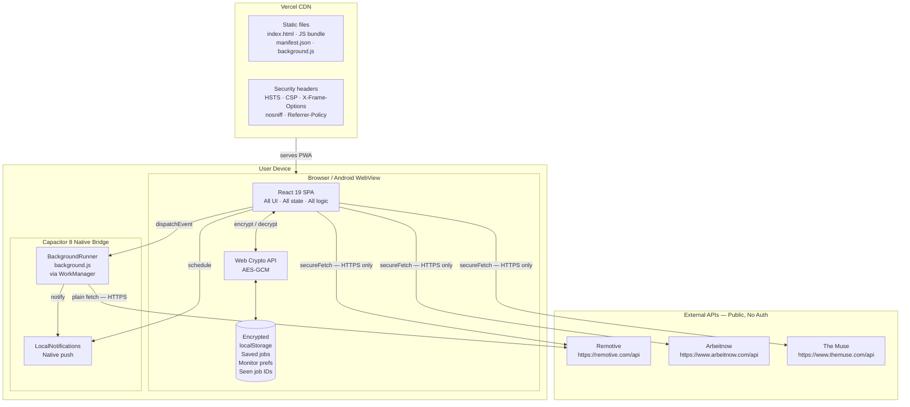
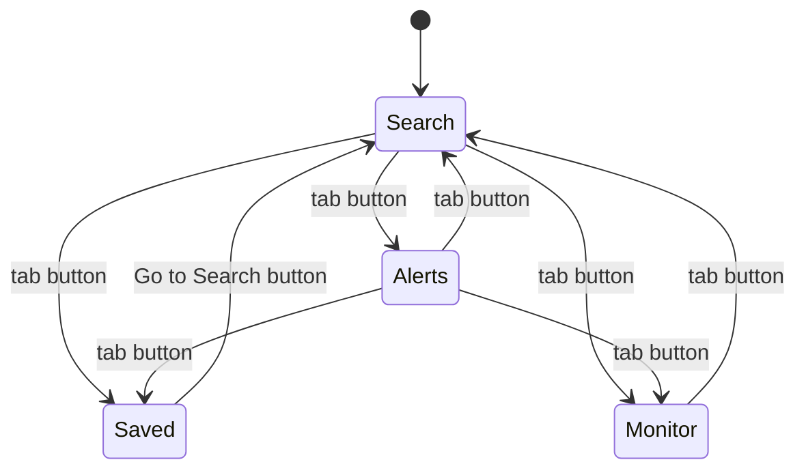
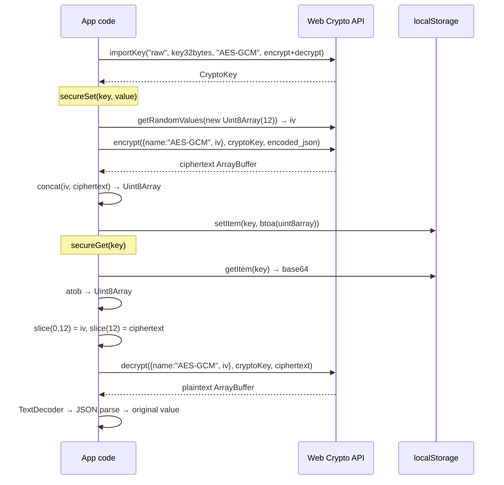
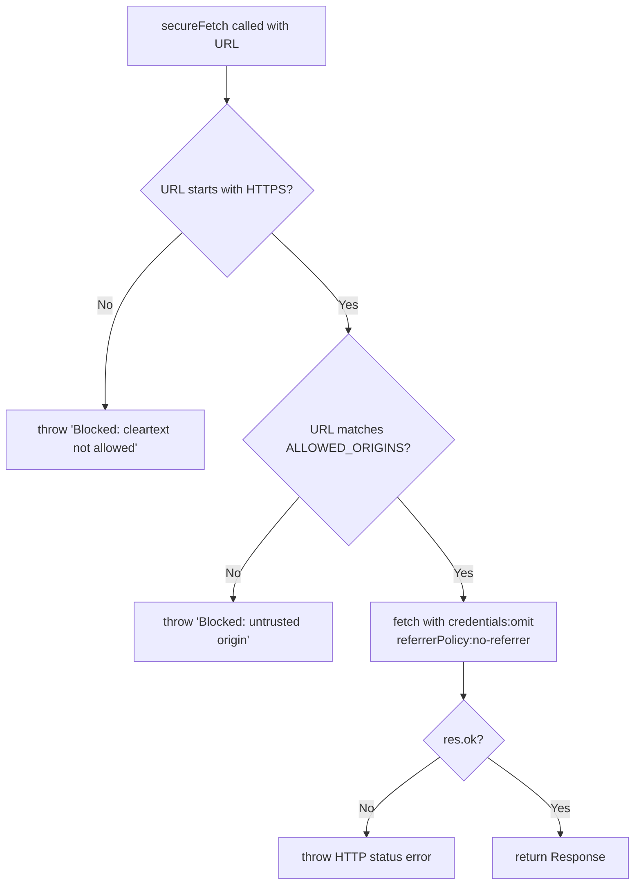
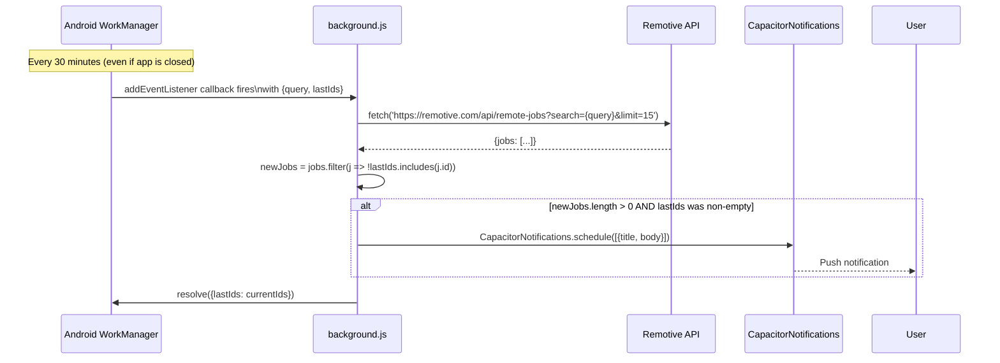
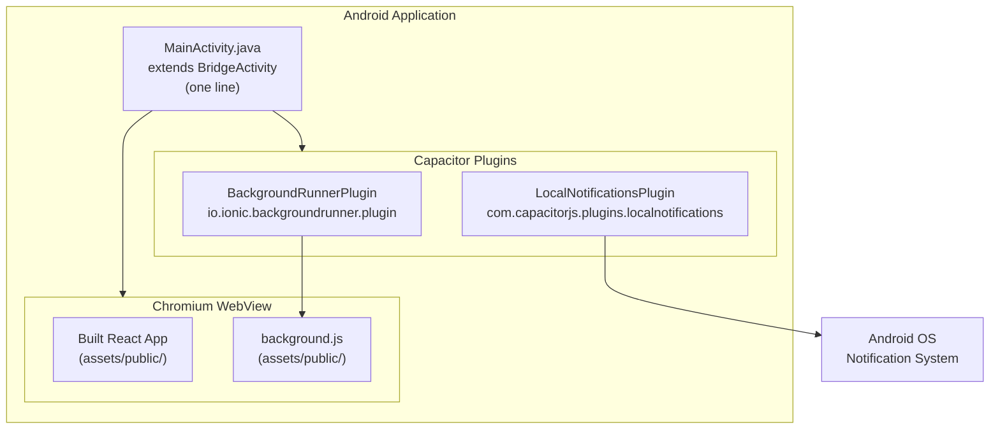
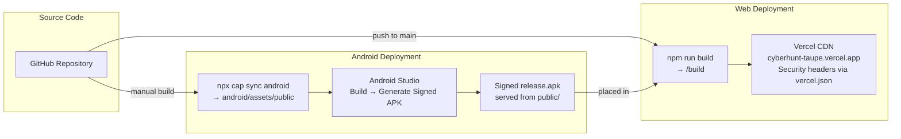
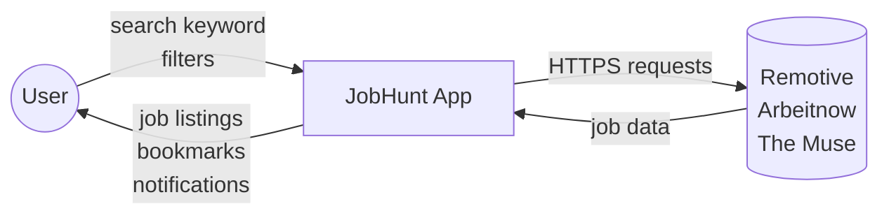
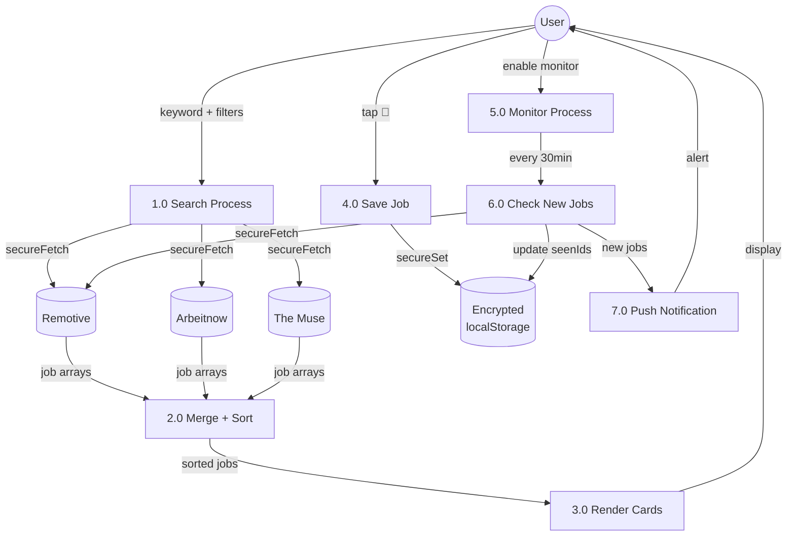
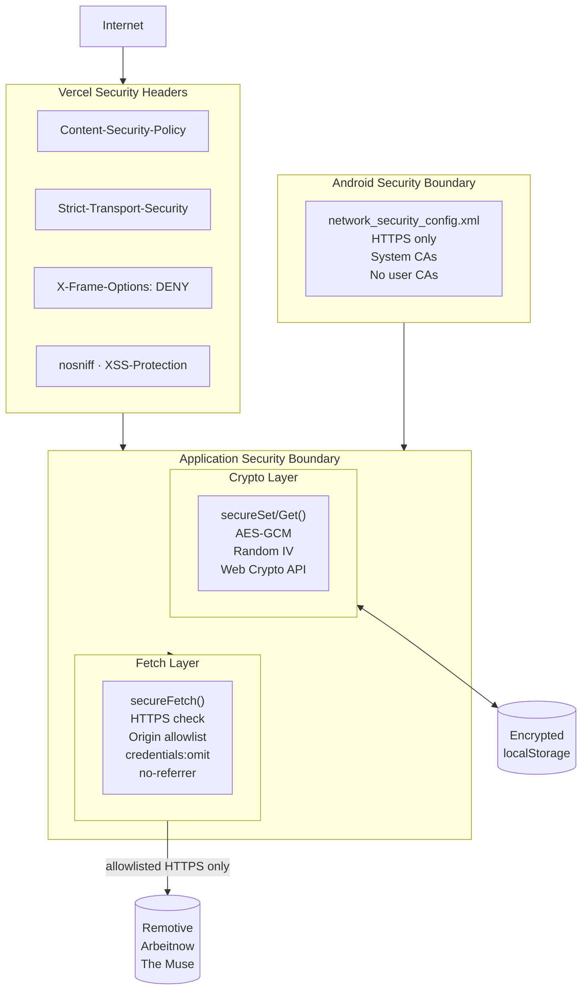

# Architecture

JobHunt is a client-only, zero-backend application. There is no server, no database, and no authentication system. This document explains every architectural decision and how the components interact.

---

## Table of Contents

- [High-Level Overview](#high-level-overview)
- [System Architecture Diagram](#system-architecture-diagram)
- [Application Layer](#application-layer)
- [Data Layer](#data-layer)
- [Network Layer](#network-layer)
- [Background Processing](#background-processing)
- [Android Native Layer](#android-native-layer)
- [Deployment Architecture](#deployment-architecture)
- [Data Flow Diagrams](#data-flow-diagrams)
- [Component Tree](#component-tree)
- [State Management](#state-management)
- [Security Architecture](#security-architecture)

---

## High-Level Overview

```
Browser / Android WebView
        │
        ▼
   React 19 SPA
   (single App.js)
        │
   ┌────┴────────────────────┐
   │                         │
   ▼                         ▼
secureFetch()          Capacitor Bridge
(HTTPS allowlist)      (BackgroundRunner
   │                    LocalNotifications)
   ▼                         │
External APIs           Android WorkManager
Remotive                      │
Arbeitnow               background.js
The Muse                (every 30 min)
```

**No server process runs between the user's device and the external APIs.** The app talks directly to Remotive, Arbeitnow, and The Muse from the browser or Android WebView.

---

## System Architecture Diagram



---

## Application Layer

The entire application lives in `src/App.js` (780 lines). It is organized into these logical sections:

```
src/App.js
├── Crypto utilities          getCryptoKey, secureSet, secureGet
├── Network utilities         ALLOWED_ORIGINS, secureFetch
├── Constants                 PLATFORMS, JOB_TYPES, WORK_MODES, ALERT_PLATFORMS
├── Helper functions          isRecentlyPosted, timeAgo
├── API fetchers              fetchRemotive, fetchArbeitnow, fetchTheMuse
└── React components
    ├── RadarPulse            Animated header icon (pure CSS)
    ├── Toast                 Transient message (auto-dismiss 2.6s)
    ├── FilterChips           Reusable horizontal chip row
    ├── JobCard               Single job listing card
    ├── AlertCard             Single email alert platform row
    └── JobHunt (default)     Root component — all state and all tab UIs
```

### Tab Structure

The application uses a tab-based navigation pattern implemented with a single `tab` state variable:



Each tab is conditionally rendered with `{tab === "search" && (...)}`. There is no routing library.

---

## Data Layer

### Persistence (localStorage with AES-GCM)

There is no database. Persistence is handled entirely via `localStorage` with AES-GCM encryption:

| Key | Content | Encrypted |
|-----|---------|-----------|
| `savedJobs` | Array of job objects the user bookmarked | Yes |
| `alertsDone` | Object map of `{platformId: boolean}` | Yes |
| `cyberMonitor` | `"on"` or `"off"` | Yes |
| `monitorQuery` | The keyword being monitored | Yes |
| `seenJobIds` | Array of Remotive job ID strings seen during monitoring | Yes |

### Encryption Implementation



**Fallback:** If encryption fails (e.g., in an HTTP context where `crypto.subtle` is unavailable), both `secureSet` and `secureGet` fall back to plain JSON `localStorage` access. This ensures the app remains functional while silently degrading security.

---

## Network Layer

### secureFetch

All outbound HTTP calls from the React app pass through `secureFetch`:



**ALLOWED_ORIGINS:**
```js
[
  "https://remotive.com",
  "https://www.arbeitnow.com",
  "https://www.themuse.com"
]
```

Any new API source must be added to this array, the Vercel CSP header, the Android network security config, and the Capacitor `allowNavigation` list.

### Parallel Search

When "All Platforms" is selected, all three API calls are made concurrently:

```js
const fetchers = [
  fetchRemotive(query, jobType).catch(() => []),
  fetchArbeitnow(query, jobType, workMode).catch(() => []),
  fetchTheMuse(query, jobType, workMode).catch(() => []),
];
const results = await Promise.all(fetchers);
const all = results.flat().sort((a, b) => new Date(b.date) - new Date(a.date));
```

Each fetcher has an individual `.catch(() => [])` so a single API failure does not suppress results from the others.

---

## Background Processing

### How background.js works

`public/background.js` is a standalone script (no React, no imports) executed by Capacitor's BackgroundRunner plugin inside Android's WorkManager:



The `lastIds.length > 0` check prevents a notification on the very first check (when the user has no baseline yet).

### WorkManager Configuration

Configured in `capacitor.config.ts`:
```ts
BackgroundRunner: {
  label: 'com.bula.cyberhunt.check',
  src: 'background.js',
  event: 'jobSearch',
  repeat: true,
  interval: 30,   // minutes
  autoStart: true,
}
```

`autoStart: true` means WorkManager registers the periodic task automatically on app launch, but it only fires notifications when `autoMonitor` is enabled (controlled by the user via the Monitor tab).

---

## Android Native Layer



`MainActivity.java` is a single line:
```java
public class MainActivity extends BridgeActivity {}
```

All Android functionality is provided by Capacitor plugins registered in `capacitor.plugins.json`. There is no custom native Android code.

---

## Deployment Architecture



---

## Data Flow Diagrams

### Level 0 — Context Diagram



### Level 1 — Internal Processes



---

## Component Tree

```
JobHunt (root — all state)
├── APK download banner (conditional — Android browser only)
├── Header
│   ├── RadarPulse
│   ├── App title + subtitle
│   ├── Last updated timestamp
│   └── Tab navigation buttons
│
├── Search Tab (conditional)
│   ├── Search <input>
│   ├── FilterChips (Platform)
│   ├── FilterChips (Job Type)
│   ├── FilterChips (Work Mode)
│   ├── Search <button>
│   ├── Stats row (Total · New · Platforms)
│   ├── Loading state
│   ├── Error state
│   ├── Empty state
│   └── JobCard × N
│       ├── Platform color bar
│       ├── Title + company + location
│       ├── Platform badge + time ago
│       ├── Work mode badge
│       ├── Job type badge
│       ├── "New" badge (conditional)
│       ├── Tag badges × 2
│       ├── Apply Now link
│       └── Save/Unsave button
│
├── Alerts Tab (conditional)
│   ├── Email alerts header
│   ├── Browser notification card
│   └── AlertCard × 4 (LinkedIn, Indeed, Google, Otta)
│       └── Setup progress bar
│
├── Saved Tab (conditional)
│   ├── Header + count
│   ├── Empty state
│   └── JobCard × N (saved jobs)
│
├── Monitor Tab (conditional)
│   ├── Monitor keyword display
│   ├── Toggle card (status + Start/Stop button)
│   ├── Stats (New Jobs Found · Check Interval)
│   └── How it works list
│
├── Bottom navigation bar
└── Toast (conditional)
```

---

## State Management

All state is managed with React `useState` and `useEffect` in the single root component `JobHunt`. There is no global state library (no Redux, no Zustand, no Context API).

| State | Type | Persisted | Description |
|-------|------|-----------|-------------|
| `tab` | string | No | Active tab: search · alerts · saved · monitor |
| `platform` | string | No | Active platform filter |
| `jobType` | string | No | Active job type filter |
| `workMode` | string | No | Active work mode filter |
| `query` | string | No | Current search keyword |
| `jobs` | array | No | Current search result set |
| `loading` | boolean | No | Search in progress |
| `error` | string|null | No | Error message for failed search |
| `toast` | string|null | No | Transient toast message |
| `saved` | array | **Yes** | Bookmarked jobs (encrypted localStorage) |
| `alertsDone` | object | **Yes** | Alert setup progress (encrypted localStorage) |
| `lastUpdated` | Date|null | No | Timestamp of last search |
| `autoMonitor` | boolean | **Yes** | Monitor enabled state (encrypted localStorage) |
| `monitorStatus` | string | No | idle · checking · active · error |
| `lastCheck` | Date|null | No | Timestamp of last monitor check |
| `newJobCount` | number | No | New jobs found since monitoring started |

`useRef(monitorRef)` holds the `setInterval` handle for monitor cleanup.

---

## Security Architecture


